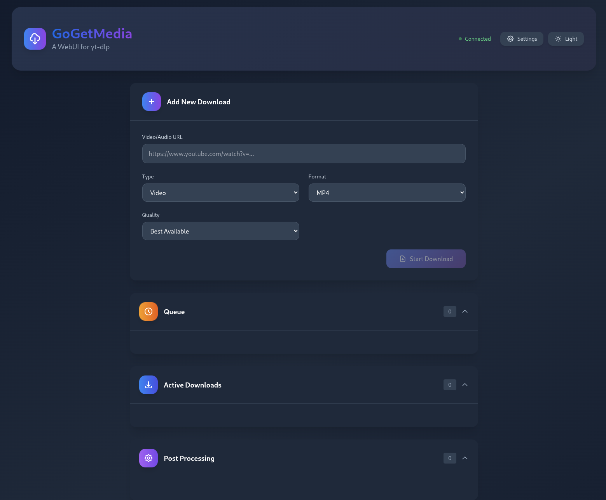

# GoGetMedia

🚧 **Work in Progress** - This project is actively being developed. Some features may be incomplete or subject to change.

A cross-platform Go-based web application for downloading videos and audio from various platforms using yt-dlp and ffmpeg.



## ✨ Features

- **Multi-format Downloads**: Download videos in MP4, MKV, WebM or extract audio in MP3, M4A, WAV, FLAC
- **Quality Selection**: Choose from best available, 4k, 2k, 1080p, 720p, 480p, 360p
- **Concurrent Downloads**: Configure simultaneous downloads
- **Smart Playlist Handling**: Automatic playlist detection with options to download single video or entire playlist

## Installation

### Make sure FFMPEG is already installed and ideally in system PATH, or set in app settings. 

### Use one of the pre-built binaries (macOS, Windows, and Linux available) from the RELEASES section to get up and running quickly, otherwise build and run as per instructions below.

1. **Clone and build:**
   ```bash
   git clone https://github.com/youruser/gogetmedia.git
   cd gogetmedia
   go build -o gogetmedia cmd/gogetmedia/main.go
   ```

2. **Run the application:**
   ```bash
   ./gogetmedia (mac/linux) or gogetmedia.exe (Windows)
   ```

### First Run
- The application will automatically download yt-dlp on first run
- Access the web interface at `http://localhost:8080`

## Command Line Options

```bash
./gogetmedia [options]

Options:
  -port int        Port to run the server on (overrides config file)
  -config string   Path to configuration file (default "config.json")

Examples:
  ./gogetmedia -port 3000              # Run on port 3000
  ./gogetmedia -config myconfig.json   # Use custom config file
```

## Configuration

The application creates a `config.json` file on first run with default settings:

```json
{
  "download_path": "downloads",
  "max_concurrent_downloads": 2,
  "yt_dlp_path": "assets/yt-dlp/yt-dlp",
  "ffmpeg_path": "ffmpeg",
  "port": 8080,
  "default_video_format": "mp4",
  "default_audio_format": "mp3"
}
```

## API Endpoints

### Core Operations
- `GET /api/config` - Get current configuration
- `POST /api/config` - Update configuration
- `GET /api/downloads` - List all downloads
- `POST /api/downloads` - Start a new download
- `POST /api/downloads/playlist` - Start playlist download
- `POST /api/downloads/first-video` - Download first video from playlist
- `POST /api/validate` - Validate URL and detect playlists

### Download Management
- `DELETE /api/downloads/{id}` - Remove a download
- `POST /api/downloads/{id}/cancel` - Cancel active download
- `POST /api/downloads/{id}/pause` - Pause download
- `POST /api/downloads/{id}/resume` - Resume paused download
- `POST /api/downloads/{id}/retry` - Retry failed download
- `GET /api/downloads/{id}/download` - Download completed file

### Bulk Operations
- `POST /api/downloads/clear-queued` - Clear all queued downloads
- `POST /api/downloads/delete-completed` - Delete all completed downloads
- `POST /api/downloads/clear-failed` - Clear all failed downloads

### System
- `GET /api/yt-dlp/version` - Check for yt-dlp updates
- `POST /api/yt-dlp/update` - Update yt-dlp
- `GET /api/versions` - Get current yt-dlp and ffmpeg versions

## License

This project is open source and available under the MIT License.